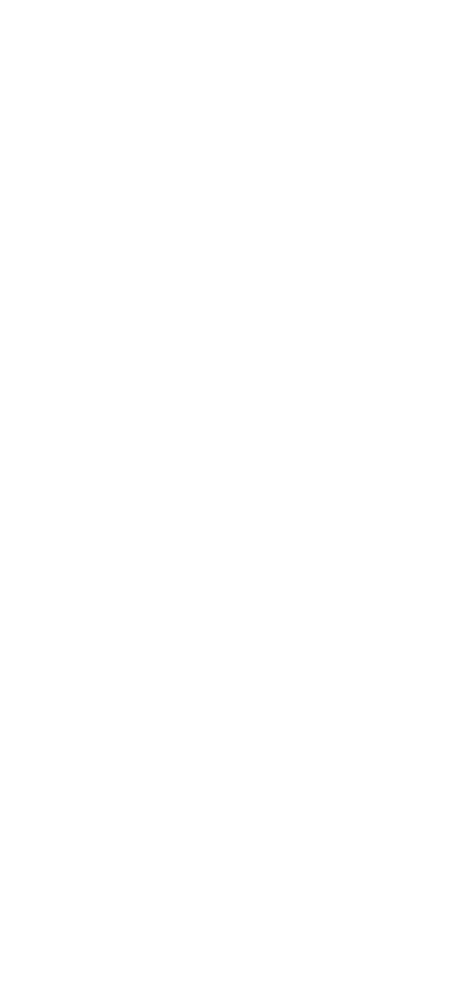
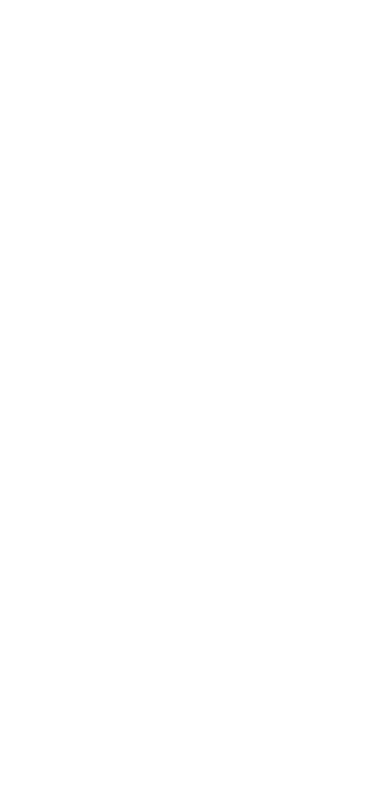
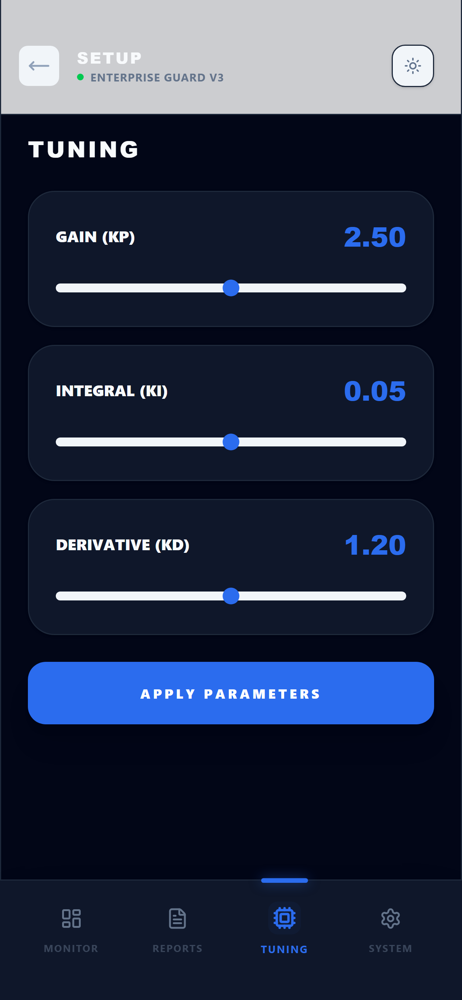
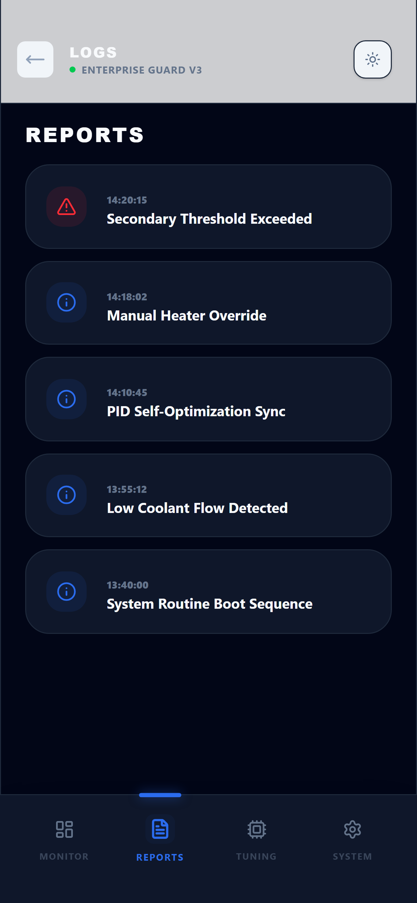

# 🏛️ Thermocore Enterprise Dashboard V3

[](https://github.com/)
[](https://react.dev/)
[](https://tailwindcss.com/)
[](https://github.com/)

**Thermocore Enterprise** is a sophisticated, industrial-grade monitoring solution designed for thermal control systems. It provides real-time telemetry, advanced PID tuning capabilities, and persistent event logging in a high-fidelity interface optimized for control room operators.

---

## 📱 Interface Preview

| Dashboard (Dark) | Dashboard (Light) |
| :---: | :---: |
|  |  |

| System Tuning | Event Reports |
| :---: | :---: |
|  |  |

---

## 🚀 Core Capabilities

### 🛡️ Industrial Stability
- **Real-time Telemetry**: Sub-second temperature tracking with step-chart visualization for stability analysis.
- **Fail-safe Design**: Integrated hardware kill-switch and system health reporting.
- **Node Monitoring**: Dynamic status indicators for active thermal relays and flow pumps.

### ⚙️ Precision Engineering
- **PID Control Interface**: Granular adjustment of Kp, Ki, and Kd parameters with unified "Commit" workflows.
- **Adaptive UI**: Seamless transition between high-contrast Dark and Light themes for varied environment lighting.
- **Persistent Logging**: Structured event stream with severity-coded records for audit trails.

### 💎 Design Excellence
- **Component Architecture**: Built on a modular, semantic design system for infinite scalability.
- **Premium UX**: Fluid, physics-inspired transitions and micro-interactions powered by Framer Motion.
- **Enterprise Aesthetics**: Clean typography (Inter & Space Grotesk) and high-density information display.

---

## 🛠️ Technical Stack

- **Frontend**: React 19, TypeScript
- **Styling**: Tailwind CSS v4 (Variables-first architecture)
- **Charts**: Recharts (SVG-based reactive visualization)
- **Animations**: Framer Motion
- **Icons**: Lucide React
- **Packaging**: Vite 7 (Latest)

---

## 📦 Installation & Setup

```bash
# Clone the repository
git clone https://github.com/Sashkeee/thermocore-enterprise-v2.git

# Install dependencies
npm install

# Start production-grade dev server
npm run dev

# Compile for enterprise deployment
npm run build
```

---

## 📄 Design Documentation
Refer to [DESIGN.md](./DESIGN.md) for detailed specifications on color palettes, spacing rhythm, and component geometry used in the Thermocore ecosystem.

---

*Powered by Thermocore Systems Engine. © 2026. All rights reserved.*
